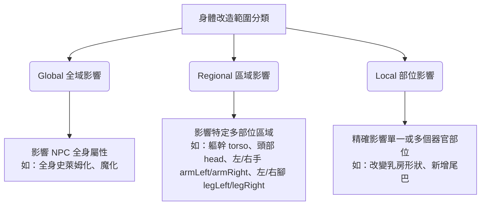

# 身體改造系統 (Body Modification System) 設計提案 (修訂版)

本提案已根據您的反饋進行了調整。本設計專注於**底層數值架構、時間適應期、互斥條件、動態部位擴充**，並且**暫不實作 AI 自動發送與回寫**（保留 promptInjection 欄位供未來擴充）。

---

## 1. 身體改造 (Body Modification) 的定義

為了避免與「裝備/道具」混淆，我們對「身體改造」進行嚴格的定義劃分：

*   **身體改造 (Body Modification)**：專指對 NPC 身體進行的**實體物理結構變更（新增器官、修改現有器官功能或形狀、刪除器官）**。
    *   *例如*：加裝额外乳房、將乳房形狀改變為桃心型、移除子宮、加裝尾巴、將部分身體改造成流體化等。
*   **裝備與道具 (Equipment/Item)**：非實體肉體變更的裝置，均歸類在物品系統中。
    *   *例如*：植入式晶片、外接機械義肢、遙控震動器、貞操鎖等。

---

## 2. 系統架構與影響範圍分類

改造不再按「穿刺、植入、化學」分類，而是改為**三種影響範圍**：



---

## 3. 資料結構設計 (TypeScript)

### 3.1 改造定義 (Static Data / 靜態資料庫)

```typescript
export type BodyModScope = 'global' | 'regional' | 'local';

// 預置的特徵效果類型
export type PredefinedTraitType =
  | 'text_only'       // 僅作為文字描述演繹
  | 'stat_modifier'  // 附帶額外的數值影響 (如 [敏感體質] 導致額外敏化)
  | 'behavioral';     // 影響特定日常結算或行為機率

export interface PredefinedTrait {
  id: string;
  name: string;
  description: string;
  type: PredefinedTraitType;
  modifiers?: AttrModifier[]; // 若為 stat_modifier 則可帶有額外加成
}

export interface BodyModificationDef {
  id: string;
  name: string;
  description: string;
  scope: BodyModScope;

  // 當 scope 為 local/regional 時所影響的部位。若為 global 則為空陣列。
  // 支援內置與動態器官（見 4.1 說明）
  slots: string[];

  // 改造所需費用與材料
  cost: {
    money?: number;
    pts?: number;
    mcEnergy?: number;
    requiredItems?: Array<{ itemId: string; quantity: number }>;
  };

  // 改造限制條件
  conditions: {
    minObedience?: number;     // 需求的最低服從度
    minLust?: number;          // 需求的最低淫欲
    requiredLocationId?: string; // 限制特定地點才能動手術 (例如 hospital, laboratory)
  };

  // 改造容量負荷。每個部位可容納的改造上限由角色的屬性 (如體質、MC上限) 決定
  loadCost: number;

  // 基礎數值變更
  modifiers: AttrModifier[];

  // 週期性或條件性觸發定義 (例如: 每日泌乳、特定時間發情)
  triggerEffect?: {
    triggerType: 'daily' | 'hourly' | 'on_orgasm' | 'on_arousal_threshold';
    effectDescription: string; // 供程式判斷或結算用的邏輯標籤，例如 "lactate" (泌乳) 或 "estrus" (發情)
  };

  // 隨機副作用 / 特徵池 (由預置的 Traits 中選擇)
  potentialTraitIds?: string[];

  // 故事提示詞注入欄位 (目前保留，不進行發送/注入實作)
  promptInjection?: string;
}
```

### 3.2 角色身上的改造狀態 (Runtime / MVU 變數)

```typescript
export interface NPCBodyModState {
  id: string;                 // 對應 BodyModificationDef.id
  installedVirtualTime: string; // 安裝時的虛擬時間 (格式如 "YYYY-MM-DD HH:mm")
  isActive: boolean;          // 當前是否啟用
  selectedTraits: string[];   // 此次改造所產生的特徵/副作用 ID 列表

  // 適應期設定
  adaptation?: {
    endVirtualTime: string;   // 適應期結束的虛擬時間
    extraModifiers: AttrModifier[]; // 適應期間的額外增減益 (例如：排異痛楚導致 affection 下降)
  };

  // 靈活的自訂參數，適應多種自訂改造類型
  customParams?: Record<string, {
    label: string;
    type: 'string' | 'number' | 'boolean';
    value: any;
  }>;
}
```

---

## 4. 關鍵機制靈感與設計

### 💡 4.1 豐富的內置部位與動態器官擴充 (`extra` 機制)

為了給玩家足夠的自由度，並讓程式具有一致的屬性判定標準，我們大幅擴展了系統**內置的身體部位**：

*   **內置部位清單 (Built-in Parts)**：
    *   **感官與頭部**：`brain` (大腦), `eyeLeft` (左眼), `eyeRight` (右眼), `earLeft` (左耳), `earRight` (右耳), `nose` (鼻子), `throat` (喉嚨)
    *   **消化與內部**：`stomach` (胃), `intestines` (腸道), `womb` (子宮)
    *   **四肢與軀幹**：`torso` (軀幹), `armLeft` (左手), `armRight` (右手), `legLeft` (左腳), `legRight` (右腳), `skin` (皮膚)
    *   **敏感/性特徵**：`mouth` (口腔), `breastLeft` (左乳), `breastRight` (右乳), `vagina` (陰道), `anus` (肛門), `urethra` (尿道), `clitoris` (陰蒂)

*   **動態器官擴充**：
    若玩家想在上述數十個內置部位之外新增其他奇特部位（如尾巴、翅膀、額外的第三乳房）：
    我們在 NPC 的 `bodyParts` 中，新增一個擴充鍵 `extra`：
    ```typescript
    export interface BodyPartsDefs {
      // ... 數十個內置部位 ...
      // 動態新增器官 (如: tail, wings, thirdBreast)
      extra?: Record<string, BodyPartStat & { displayName: string; category: string; isRemoved?: boolean }>;
    }
    ```
    *   **新增器官**：在 `bodyParts.extra[new_part_id]` 中註冊，並初始化其敏感度與鬆緊度。
    *   **刪除/切除器官**：標記 `isRemoved: true`，此時對應的器官屬性與交互功能將被停用。

### 💡 4.2 虛擬時間適應期 (Adaptation Period)
*   **計算方式**：系統不需要跑後台計時器，而是依據遊戲中的**「虛擬時間」**。
*   每次虛擬時間前進時（例如玩家進行活動、睡覺、消耗時間前進），程式會比較 `system.time` 與 `adaptation.endVirtualTime`。
*   若當前虛擬時間小於結束時間，適應期仍在進行中，NPC 受到 `extraModifiers` 的副作用影響（例如因不適感導致 `affection` 每日結算時小幅扣減）。
*   一旦 `system.time >= endVirtualTime`，適應期結束，額外副作用移除，並可觸發一個「適應完成」的通知事件。

### 💡 4.3 週期性與條件性觸發
*   **週期性結算 (如泌乳、發情)**：
    *   在每日結算時，系統遍歷 NPC 所有啟用的改造。
    *   若改造含有 `triggerType: 'daily'` 且觸發標籤為 `"lactate"`，系統會檢查是否滿足條件，滿足則在 NPC 的背包 (`chars[npc].inventory`) 中自動新增數量 `+1` 的 `item_milk` (母乳)。
    *   這讓改造具備了實際的「生產/產出」物品交互能力。

---

## 5. UI 與體驗設計 (OS 風格)

為了適應長時間遊玩的舒適感，UI 避免使用刺眼、過於花哨的特效，而是採用**「簡潔霓虹深色 (Glassmorphism)」**的催眠 OS 風格。

1.  **人體 SVG 輪廓剪影 (SVG Silhouette Map)**：
    *   畫面中間放置一個極簡的角色身體 SVG 剪影。
    *   依據角色的性別與擁有的 `bodyParts`，在對應位置渲染半透明的「呼吸發光節點（小圓點）」。
    *   因為部位眾多（數十個），為了避免 UI 擁擠，可以採取**「區域分頁 / 局部放大」**設計：點擊 SVG 的大區域（如：頭部、軀幹、四肢、私處），會放大該區域並顯現該區域底下的所有細微部位節點。
    *   如果 NPC 動態新增了器官（例如 `extra.tail` 尾巴），SVG 旁會動態延伸出一條引線與節點。
    *   點擊節點即可在右側舒適地展開該部位屬性（敏感度、鬆緊度、負載 load）與安裝的改造項目。
2.  **部位容量限制條 (Capacity Slot)**：
    *   每個部位或全域顯示一個 `[████░░░░░░] 4/10 Load` 的負荷條，清楚呈現該部位還能承受多少改造，防止超出體質上限。
3.  **手術/改造工坊與地點檢查**：
    *   若玩家當前所處地圖節點（由地圖 APP 同步）與改造要求的 `requiredLocationId` 不符，按鈕顯示為灰色並提示 *「需要前往特定的 [醫療室/實驗室] 才能執行此改造」*，增加探索與代入感。


Comments
Artifact Comments
Body Modification System Proposal

系統核心架構
我需要說明:目前預計需要給劇情推進AI(即不是供OS內填述職的AI)的提示詞只在玩家推進樓層時注入，並且AI推竟結果也是讀取AI回復中的特定格式來做出數值更動。
所以目前開發還不需要考慮AI發送與AI回寫。

export type BodyModSlot = 'mouth' | 'breastLeft' | 'breastRight' | 'vagina' | 'anus' | 'urethra' | '...
如果改造位置不再類型中該怎麼辦?
而且有可能是冷門的部位。
玩家可能會想在這些預設位置之外做改造，但部位的區分又是程式中必要的。

[SLIME_BODY] 與 [MECHANICAL_BODY] 互斥
互斥條件或許可以透過改造種類與部位來決定?

potentialTraits?: string[]; // 例如: ['[漏尿體質]', '[感官過載]', '[心理依賴]']
有沒有必要加入程式類的增/減益?

適應度 (Adaptation Level):
剛改造完時，適應度為 0%。此時 NPC 可能會產生「排異反應」（例如：時常感到疼痛、或產生心理抵抗，使得 affection 暫時下降）。
或許可以增加一個適應期的判定，然後是適應期有額外的增減益，結束時間可以用虛擬時間做為參照。

// 故事提示詞注入 (當擁有此改造時，會寫入 AI Character Profile 中)  promptInjection: string;    // 例如: "該角色的乳房已被安裝了催眠乳環...
可以有這欄，但注入先不用實做。

export type BodyModSlot = 'mouth' | 'breastLeft' | 'breastRight' | 'vagina' | 'anus' | 'urethra' | '...
可能需要extra類別來表示新增的器官。

地圖與環境交互：
在「妓院 APP」或「地圖 APP」的特定場所（如：檢查哨、拍賣會），NPC 身上是否擁有特定的改造會決定故事走向。例如：擁有 [機械重度改造] 的角色可能無法進入「魔法聖殿」，或是...
這個可能需要等基本完成才有機會新增，因為現在支撐事件系統所需的APP缺失的有點多，完全無法建立，所以先不考慮。

前端 UI 與 APP 實作設想
不要太華麗，也不要太普實，要舒適又維持催眠OS的風格，才能應對長期遊玩

角色身體透視圖 (Body Scanner)：
顯示 NPC 的 3D 或 2D 輪廓，點擊不同部位（頭部、胸部、腹部、私處）會高亮該部位，並列出該部位當前的敏感度、鬆緊度以及「已安裝的改造」。
或許需要人體圖並且標示部位之類的UI?

手術台/改造工坊 (Modification Workshop)：
列出所有可用的改造方案。對於未解鎖的項目，顯示「條件不足」（例如：缺乏 item_hypno_serum 或服從度未達標），已滿足條...
這裡可能與地點連動?後續可能還需要與產業APP連動

potentialTraits?: string[]; // 例如: ['[漏尿體質]', '[感官過載]', '[心理依賴]']
要預置類型來限制嗎?

slots: BodyModSlot[];        // 佔用的身體部位 (可多選，例如雙乳改造同時佔用 breastLeft & breastRight)
或許可以依照角色的數值來分配各個部位可以容納的改造上限。

// 改造條件與限制  conditions: {    minObedience?: number;     // 需求的最低服從度 (否則會掙扎、排斥)    minLust?: number; ...
還有改造所需要的花費。

| 'piercing'      // 穿刺類 (如: 乳環、陰蒂環)  | 'implant'       // 植入物 (如: 催眠晶片、魔力核心)  | 'drug'          // ...
可能需要改分類依據?
例如分成三種影響範圍，整體、範圍、部位。

改造定義
目前我對於身體改造的定義是:對角色的身體有新增部位、修改部位、刪除部位才算，例如加裝器官、改變乳房的功能或形狀、移除某個器官。
而植入式芯片、機械義肢等等都算成物品裡的裝備。

// 當前是否啟用 (例如有些裝置可被「遠端關閉」或「鎖定」)
因為裝備類定義，所以這裡的應該是類似每天晚上發情或泌乳等等。
還有周期性或條件性啟動的該怎麼辦?

customParams?: {          // 玩家自訂的參數 (例如: 鐫刻名字、設定頻率)    label?: string;    intensity?: number;     /...
這裡可能要想想怎麼適應多種多樣的身體改造類型。
